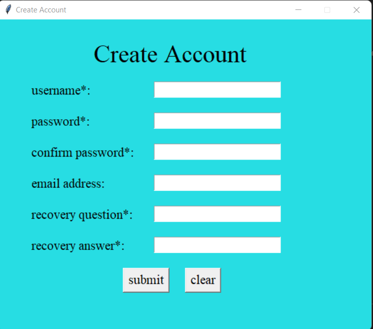

# Password-Manager
Password Manager application is a desktop application to store account login details.This application helps to manage user passwords and reduces the risk to sensitive data being easily accessed on the brower. With this applicatin there is no need no save login details on the browser as it is not safe and can be accessed by anyone who uses the same browser. Saving all login details on this application will help on keeping track on all the accounts a user have  
Stored accounts details are accessed with one master password. 
To use the application, user must first login or create an account if not registered. 
In the application user can add new data record, delete or modify existing data record.
 
 

## Run code

To run the program, mysql, tkinter and python3 must be installed in the running machine.

